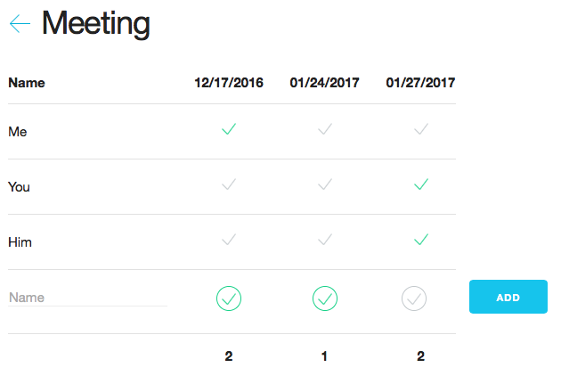

# DoodElm

This is a toy project to explore the possibilities of Elm. It reproduces a
basic Doodle webapp.

Run `elm-make src/Main.elm --output elm.js` and open `index.html`

Data should be handled in a [Postgres database](https://www.postgresql.org) and
provided through the [PostgREST](http://postgrest.com) API.

Design was build on top of [skeleton](http://getskeleton.com).

## Screenshot

### Display a doodle

### Create a doodle

